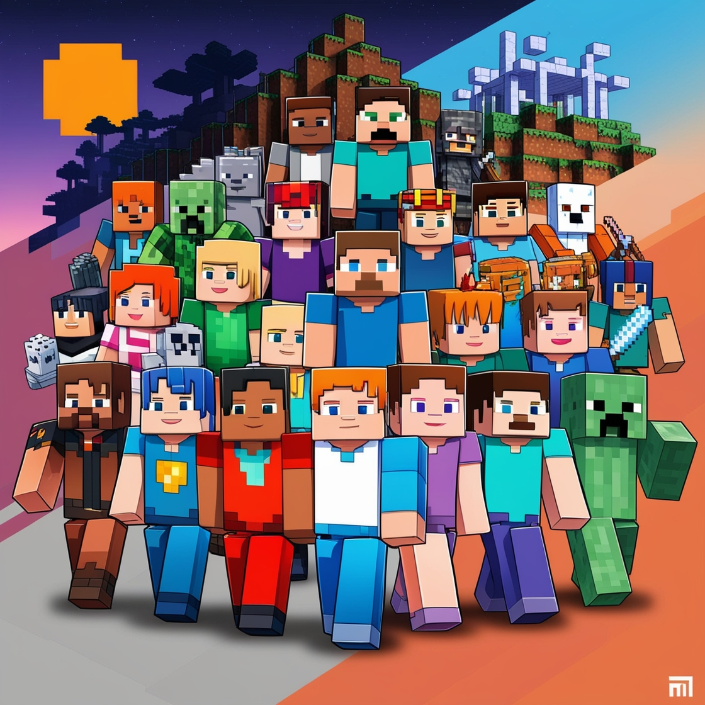

Projeto: Mods de Minecraft

Este projeto é um site interativo que apresenta informações sobre mods populares de Minecraft. A ideia é oferecer um espaço para explorar as funcionalidades de cada mod, com imagens, descrições e links úteis.

*Tecnologias Utilizadas*

- HTML5: Estruturação do conteúdo.
- CSS3: Estilização e layout responsivo.
- JavaScript: Funcionalidades dinâmicas no site.
- Git: Controle de versão do projeto.

*Mods Apresentados*

1. **Dragon Block**  
   Traga o universo de Dragon Ball para o Minecraft! Lute contra vilões, desbloqueie transformações e use poderes incríveis como o Kamehameha.  
   

2. **Custom NPC's**  
   Crie NPCs personalizados para missões, histórias ou interações no jogo.  
   

3. **Mine Mine no Mi**  
   Adicione as Frutas do Diabo de One Piece ao Minecraft e use seus poderes.  
   

4. **Orespawn**  
   Expanda o universo do Minecraft com novos mobs, itens, chefes e dimensões.  
   

5. **More Player Models**  
   Personalize seu personagem com novas animações, modelos e skins.  
   

6. **Journey Map**  
   Um minimapa que ajuda a explorar e marcar locais no mundo.  
   
